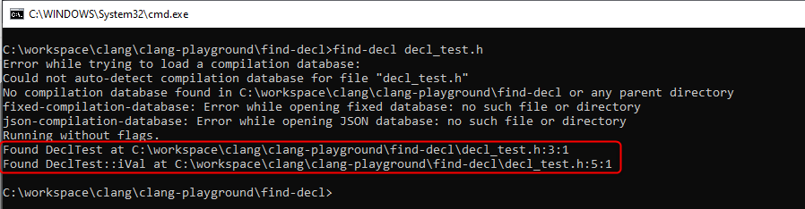

clang-playground
================

This is the fork of https://github.com/xinhuang/clang-playground the repository for clang-playground series.

## How to Build Visual Studio 2017

Clone & build llvm-project source:  
```
git clone https://github.com/llvm/llvm-project.git -b llvmorg-9.0.0-rc5
mkdir build && cd build
cmake -G "Visual Studio 15 Win64" ../llvm -DLLVM_ENABLE_PROJECTS="clang;clang-tools-extra" -DLLVM_BUILD_TESTS=ON -DCMAKE_INSTALL_PREFIX=./install
cmake --build . --target install
set Clang_DIR=<llvm-repository>/build/0install
```

Clone & build clang-playground source:  
```
git clone https://github.com/AchimTuran/clang-playground.git
mkdir build && cd build
cmake -G "Visual Studio 15 Win64" ..
cmake --build .
```

## Example Run
```
cd find-decl
find-decl decl_test.h
```



## find-decl

Find all the declarations in a given file.

Tutor: [Clang Playground: Finding Declarations]

[Clang Playground: Finding Declarations]:http://xinhuang.github.io/clang/2014/10/19/clang-playground-finding-declarations

